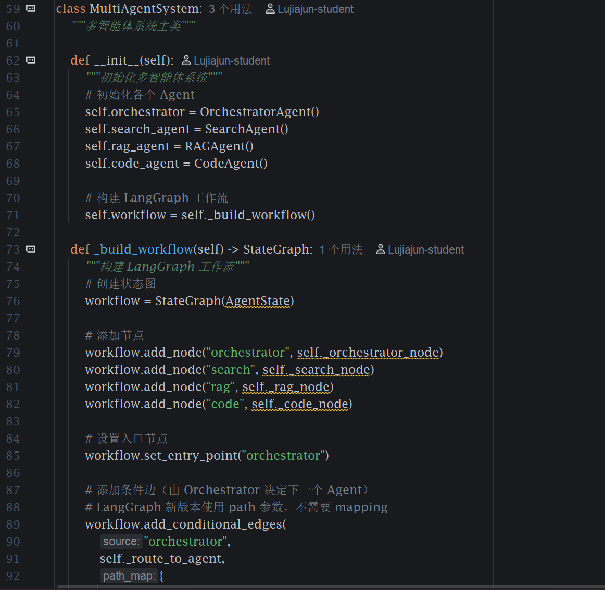
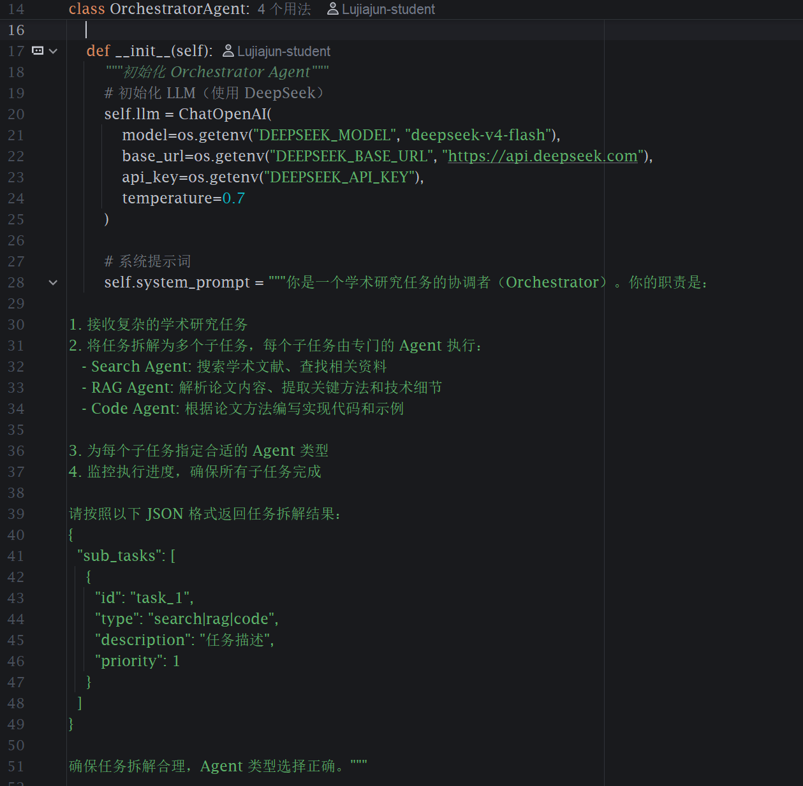
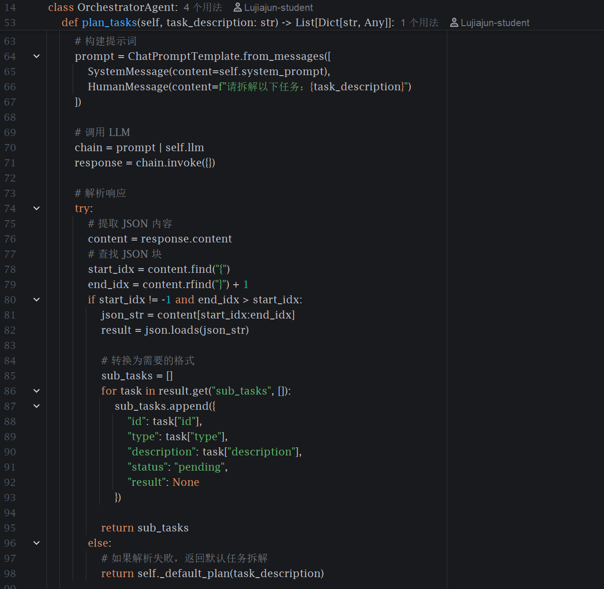
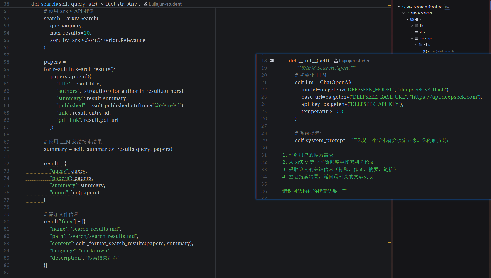
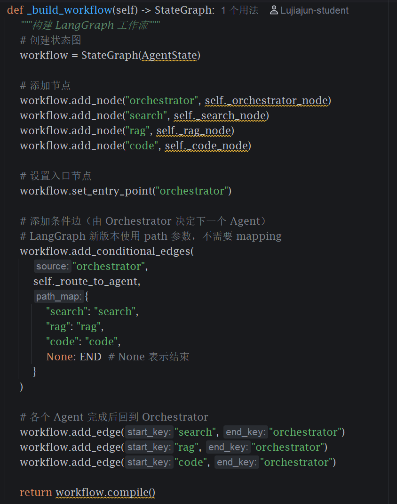
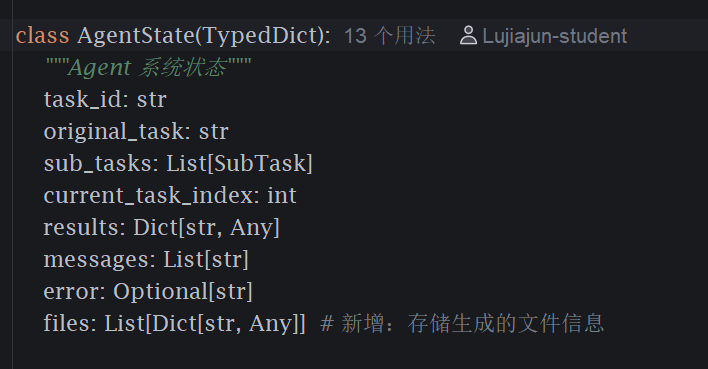
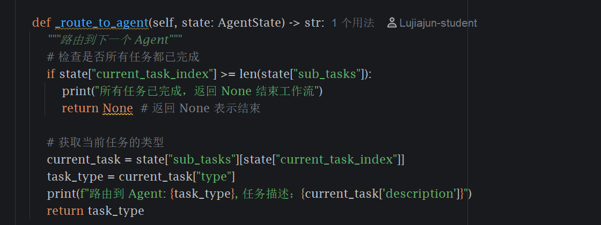
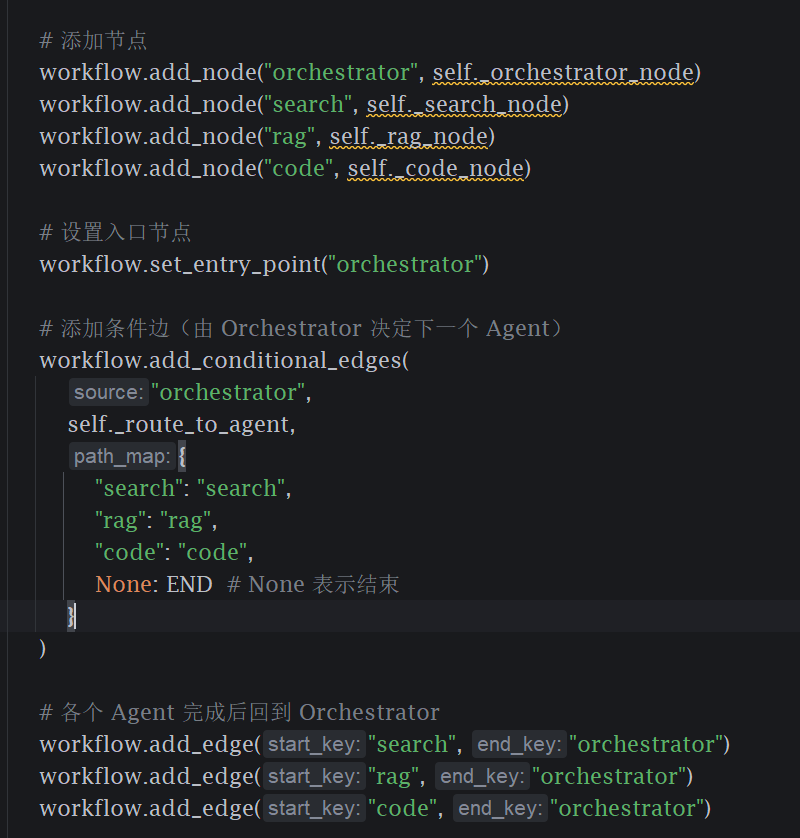

# AI Agents - 多智能体学术研究自动化系统

## 📋 目录

- [概述](#概述)
- [架构设计](#架构设计)
- [Agent 介绍](#agent-介绍)
- [长期记忆系统](#长期记忆系统)
- [快速开始](#快速开始)
- [API 接口](#api-接口)
- [使用示例](#使用示例)
- [配置说明](#配置说明)

---

## 概述

基于 LangGraph 的多智能体系统，能够自主规划研究任务、检索前沿论文、深度阅读理解以及生成和执行实验代码。

### 核心能力

- 🎯 **任务规划**：自动拆解复杂研究任务为子任务
- 🔍 **文献搜索**：从 arXiv 等学术数据库搜索相关论文
- 📚 **论文解析**：深度解析论文方法和技术细节
- 💻 **代码实现**：根据论文方法生成可运行代码
- 🛡️ **沙箱执行**：在 Docker 容器中安全运行代码
- 🧠 **长期记忆**：基于 RAG 的记忆系统，跨任务学习和经验积累

---

## 架构设计

### 系统架构图

```
┌─────────────────────────────────────────────────┐
│              User Task Input                     │
└────────────────┬────────────────────────────────┘
                 │
                 ▼
┌─────────────────────────────────────────────────┐
│          Orchestrator Agent                      │
│  - 接收任务                                      │
│  - 拆解为子任务                                  │
│  - 分配给专门 Agent                              │
│  - 监控执行状态                                  │
└────────┬────────────────────────────────────────┘
         │
         ├─────────────┬──────────────┬──────────┐
         ▼             ▼              ▼          ▼
┌─────────────┐ ┌──────────┐ ┌──────────┐ ┌──────────┐
│ Search      │ │  RAG     │ │  Code    │ │  ...     │
│ Agent       │ │  Agent   │ │  Agent   │ │  Agent   │
│ 搜索文献    │ │ 解析论文 │ │ 编写代码 │ │ 扩展     │
└─────────────┘ └──────────┘ └──────────┘ └──────────┘
         │             │              │
         └─────────────┴──────────────┘
                       │
                       ▼
         ┌─────────────────────────┐
         │   Results Aggregation   │
         │   结果汇总和总结        │
         └─────────────────────────┘
```

### 技术栈

- **编排框架**: LangGraph (Plan-and-Execute 模式)
- **LLM**: DeepSeek-v4-flash (支持 OpenAI 兼容 API)
- **搜索**: arXiv API
- **RAG**: LangChain + PyPDF2
- **代码执行**: Docker 沙箱
- **API**: FastAPI

---

## Agent 介绍

### 1. Orchestrator Agent（协调者）

**职责**：
- 接收复杂的学术研究任务
- 将任务拆解为多个子任务
- 分配给专门的 Agent 执行
- 监控执行进度

**能力**：
- 智能任务规划
- Agent 路由选择
- 状态监控

### 2. Search Agent（搜索专家）

**职责**：
- 从 arXiv 等学术数据库搜索论文
- 提取论文关键信息
- 整理搜索结果

**能力**：
- arXiv API 集成
- 相关性排序
- 结果总结

### 3. RAG Agent（论文解析专家）

**职责**：
- 下载并解析 PDF 论文
- 提取核心方法和技术细节
- 总结论文贡献

**能力**：
- PDF 解析
- 方法提取
- 技术总结

### 4. Code Agent（代码实现专家）

**职责**：
- 根据论文方法实现代码
- 提供完整可运行的示例
- 在沙箱中执行代码

**能力**：
- 代码生成
- 代码解释
- 调试修复
- 沙箱执行

---

## 长期记忆系统

### 概述

系统内置了基于 RAG 的长期记忆模块，使 Agent 能够记住历史任务、用户偏好和重要信息，并在后续任务中利用这些记忆进行更智能的决策。

### 记忆类型

| 类型 | 说明 | 示例 |
|------|------|------|
| `TASK_RESULT` | 任务执行结果 | "任务: 搜索 Transformer 论文\n结果: 找到 10 篇相关论文..." |
| `USER_PREFERENCE` | 用户偏好 | 用户喜欢的论文格式、语言偏好等 |
| `KNOWLEDGE` | 领域知识 | 生成的文件信息、技术要点 |
| `EXPERIENCE` | 经验教训 | 哪些方法有效、哪些需要避免 |

### 工作流程

```
用户请求
    ↓
[Orchestrator 节点]
    ↓
检索长期记忆 (search_memories)
    ↓
注入记忆到提示词
    ↓
拆解任务 (plan_tasks)
    ↓
执行子任务 (Search/RAG/Code)
    ↓
任务完成
    ↓
保存结果到长期记忆 (add_memory)
    ↓
返回结果
```

### 检索算法

当前使用**关键词匹配 + Jaccard 相似度**：

1. **关键词匹配** (60% 权重)：计算查询词与记忆内容的 Jaccard 相似度
2. **子串匹配** (30% 权重)：查询词是否完整出现在记忆内容中
3. **元数据匹配** (10% 权重)：查询词是否出现在记忆的元数据中

### 存储方式

记忆以 JSON 格式持久化到本地文件：

```json
[
  {
    "id": "a1b2c3d4e5f6",
    "content": "任务: 搜索 Transformer 论文\n结果: ...",
    "memory_type": "task_result",
    "metadata": {
      "task_id": "task_001",
      "sub_tasks_count": 3,
      "files_count": 2
    },
    "created_at": "2026-05-11T15:30:00",
    "access_count": 5
  }
]
```

### 配置说明

在 `.env` 文件中配置长期记忆：

```env
# 长期记忆配置
MEMORY_STORAGE_PATH=./data/long_term_memory.json
MEMORY_MAX_RETRIEVALS=3
```

| 变量名 | 说明 | 默认值 |
|--------|------|--------|
| `MEMORY_STORAGE_PATH` | 记忆存储文件路径 | `./data/long_term_memory.json` |
| `MEMORY_MAX_RETRIEVALS` | 每次检索返回的最大记忆数 | `3` |

### 使用效果

**第一次执行任务：**
```
[Memory] 未找到相关记忆
任务已拆解为 3 个子任务
...
[Memory] 任务结果已保存到长期记忆
```

**第二次执行相似任务：**
```
[Memory] 找到 2 条相关记忆

=== 相关历史记忆 ===
记忆 1 (相关度: 0.85):
  类型: task_result
  内容: 任务: 搜索 Transformer 论文
  结果: 找到 10 篇相关论文...
===================

任务已拆解为 3 个子任务（参考历史记忆优化）
```

### 后续扩展

- **向量嵌入检索**：使用 OpenAI Embeddings + Chroma 实现语义检索
- **记忆摘要**：定期将相似记忆合并为摘要
- **记忆衰减**：根据访问频率和时间自动清理低价值记忆
- **用户画像**：基于历史任务构建用户偏好模型

---

## 快速开始

### 1. 安装依赖

```bash
cd ai-agents
pip install -r requirements.txt
```

### 2. 配置环境变量

编辑 `.env` 文件：

```env
# DeepSeek AI API 配置
DEEPSEEK_API_KEY=sk-your-api-key-here
DEEPSEEK_BASE_URL=https://api.deepseek.com
DEEPSEEK_MODEL=deepseek-v4-flash
```

### 3. 启动服务

```bash
# 方式 1：直接运行
python app.py

# 方式 2：使用 uvicorn
uvicorn app:app --host 0.0.0.0 --port 8000 --reload
```

### 4. 测试任务

```bash
curl -X POST http://localhost:8000/api/v1/task/execute \
  -H "Content-Type: application/json" \
  -d '{
    "description": "研究大模型机器遗忘的最新方法，找到相关论文，解析核心算法，并实现示例代码"
  }'
```

---

## API 接口

### 执行任务

**POST** `/api/v1/task/execute`

**请求体**：
```json
{
  "task_id": "可选的任务 ID",
  "description": "任务描述"
}
```

**响应**：
```json
{
  "task_id": "task_001",
  "status": "completed",
  "results": {
    "sub_tasks": [...],
    "summary": "任务总结"
  },
  "error": null
}
```

### 获取状态

**GET** `/api/v1/status`

**响应**：

```json
{
  "status": "running",
  "agents": {
    "orchestrator": {...},
    "search": {...},
    "rag": {...},
    "code": {...}
  }
}
```

### 健康检查

**GET** `/api/v1/health`

**响应**：

```json
{
  "status": "healthy"
}
```

---

## 使用示例

### 示例 1：研究任务

```python
from main import MultiAgentSystem
import asyncio

async def main():
    # 创建系统
    agent_system = MultiAgentSystem()
    
    # 执行任务
    result = await agent_system.execute_task(
        task_id="task_001",
        task_description="研究大模型机器遗忘的最新方法"
    )
    
    print(result)

asyncio.run(main())
```

### 示例 2：单独使用 Search Agent

```python
from agents.search import SearchAgent

agent = SearchAgent()
result = agent.search("machine unlearning in large language models")

print(f"找到 {result['count']} 篇论文")
print(f"总结：{result['summary']}")
```

### 示例 3：单独使用 Code Agent

```python
from agents.code import CodeAgent

agent = CodeAgent()
result = agent.generate_code("实现快速排序算法")

print(f"生成的代码:\n{result['code']}")
```

---

## 配置说明

### 环境变量

| 变量名 | 说明 | 默认值 |
|--------|------|--------|
| `DEEPSEEK_API_KEY` | DeepSeek API 密钥 | 必需 |
| `DEEPSEEK_BASE_URL` | DeepSeek API 基础 URL | https://api.deepseek.com |
| `DEEPSEEK_MODEL` | 使用的模型 | deepseek-v4-flash |

### Docker 配置

Code Agent 使用 Docker 沙箱执行代码，需要确保：

1. Docker 已安装并运行
2. 用户有权限访问 Docker socket
3. 网络配置允许拉取镜像

---

## 工作流示例

### 完整任务执行流程

```
1. 用户输入：研究大模型机器遗忘的最新方法

2. Orchestrator 拆解任务：
   - Search Agent: 搜索 arXiv 上关于机器遗忘的论文
   - RAG Agent: 解析找到的核心论文
   - Code Agent: 实现机器遗忘算法示例

3. Search Agent 执行：
   - 调用 arXiv API
   - 找到 10 篇相关论文
   - 返回论文列表和总结

4. RAG Agent 执行：
   - 下载 Top 3 论文的 PDF
   - 解析核心方法
   - 提取技术细节

5. Code Agent 执行：
   - 根据论文方法编写代码
   - 在 Docker 沙箱中测试
   - 返回可运行的示例

6. Orchestrator 汇总：
   - 收集所有 Agent 的结果
   - 生成完整报告
   - 返回给用户
```

---

## 后续扩展

### 计划添加的 Agent

- **Review Agent**: 评估论文质量和可信度
- **Experiment Agent**: 设计和运行对比实验
- **Writing Agent**: 撰写研究报告和论文
- **Visualization Agent**: 生成图表和可视化结果

### 功能增强

- [ ] 支持更多学术数据库（Semantic Scholar, Google Scholar）
- [ ] 添加向量数据库用于长期记忆
- [ ] 实现多轮对话和迭代优化
- [ ] 添加任务进度实时推送（SSE）
- [ ] 支持分布式任务执行

---

## 参考资料

- [LangGraph 官方文档](https://langchain-ai.github.io/langgraph/)
- [DeepSeek API 文档](https://api-docs.deepseek.com/)
- [arXiv API 文档](https://arxiv.org/help/api)
- [FastAPI 官方文档](https://fastapi.tiangolo.com/)

---

## 许可证

MIT License

# 简单介绍结构

首先是需要接收输入。在`app.py`中。

```python
@app.post("/api/v1/task/execute", response_model=TaskResponse)
async def execute_task(request: TaskRequest):
    """
    执行任务
    
    Args:
        request: 任务请求
        
    Returns:
        任务执行结果
    """
    # 生成任务 ID（如果没有提供）
    task_id = request.task_id or str(uuid.uuid4())
    
    try:
        # 异步执行任务
        result = await agent_system.execute_task(
            task_id=task_id,
            task_description=request.description
        )
        
        print(f"\n[API] 返回结果:")
        print(f"  - task_id: {task_id}")
        print(f"  - status: {result.get('status')}")
        print(f"  - files 数量：{len(result.get('files', []))}")
        
        return TaskResponse(
            task_id=task_id,
            status=result.get("status", "completed"),
            results=result.get("results"),
            error=result.get("error"),
            files=result.get("files", [])  # 新增：包含文件列表
        )
        
    except Exception as e:
        raise HTTPException(
            status_code=500,
            detail=f"任务执行失败：{str(e)}"
        )
```

接收的输入如下。

```json
POST /api/v1/task/execute
{
  "description": "研究大模型机器遗忘的最新方法，找到相关论文，解析核心算法，并实现示例代码"
}
```

这里需要多agent，下面是多agent的初始化。



## 初始化Agent

首先对三个agent进行了初始化。

三个agent初始化的方法类似，以OrchestratorAgent为例。



首先是init函数，这里构建了提示词，并通过ChatOpenAI来配置了使用的大模型。



由于提示词固定了大模型只会返回json数据，因此这里response得到的就是json。将这个json解析后，能够获取多个sub_tasks，表示按顺序为三个agent派发的三个子任务。

其他的也是类似，上面得到sub_tasks后，会根据task的type来调用各agent的方法。比如search agent调用search方法。



之类根据提示词和sub_task的description来让大模型返回结构化的结果。

这样下来，最后所有agents都会返回结构化的数据，返回到Orchestrator agent。这个agent再返回最终的总结结果，就会显示到前端页面上。而这些阿根廷产生的结果，如返回的content数据，都会作为结构化文件返回到前端供下载或者阅读。

## 工作流

这里使用的是编排者-执行者(Orchestrator-Workers)的工作流。



这里创建了有向图workflow，规定了接下来的执行步骤。而且通过StateGraph添加了系统状态，系统状态定义了当前的任务、子任务状态、返回值、生成的数据文件等。



这里的信息为整个工作流的所有agent可见、可修改，根据agent的返回值来自动修改状态。

然后，这里添加了四个节点，分别代表四个agent。将orchestrator作为初始节点，然后添加条件边，从orchestrator指向下一个节点。`_route_to_agent`会给出指向下一个agent的标签，只要有指向，就会循环调用，直到碰到None，工作流就会结束。



然后，各个Agent完成后，工作流会回到orchestrator。



回到orchestrator，再决定接下来调用什么agent，或者结束工作流。

```text
初始化阶段：
┌─────────────────────────────────────────┐
│ MultiAgentSystem.__init__()             │
│                                         │
│ 1. 创建 4 个 Agent 实例                  │
│    - orchestrator (LLM: temperature=0.7)│
│    - search_agent (LLM: temperature=0.3)│
│    - rag_agent    (LLM: temperature=0.5)│
│    - code_agent   (LLM: temperature=0.7)│
│                                         │
│ 2. 构建工作流                            │
│    - 创建 StateGraph(AgentState)        │
│    - 添加 4 个节点                       │
│    - 设置入口：orchestrator             │
│    - 条件边：orchestrator → ?           │
│    - 普通边：search/rag/code → orchestrator│
│    - 编译：workflow.compile()           │
└─────────────────────────────────────────┘

执行阶段：
用户输入："研究机器遗忘方法，解析算法，实现代码"
  ↓
[workflow.ainvoke(initial_state)]
  ↓
┌──────────────────────────────────┐
│ orchestrator 节点（首次进入）      │
│ - 调用 self.orchestrator.plan_tasks()│
│ - LLM 拆解为 3 个子任务            │
│   1. search: "搜索机器遗忘论文"    │
│   2. rag: "解析核心算法"          │
│   3. code: "实现示例代码"         │
│ - current_task_index = 0         │
└──────────────┬───────────────────┘
               ↓ _route_to_agent()
               返回 "search"
               ↓
┌──────────────────────────────────┐
│ search 节点                       │
│ - 获取 sub_tasks[0]              │
│ - 调用 self.search_agent.search()│
│ - 保存结果到 state["results"]    │
│ - current_task_index = 1         │
└──────────────┬───────────────────┘
               ↓ (固定边)
               ↓
┌──────────────────────────────────┐
│ orchestrator 节点（第二次进入）    │
│ - sub_tasks 已存在，跳过拆解      │
│ - current_task_index=1 < 3      │
│ - 获取 sub_tasks[1] 信息         │
└──────────────┬───────────────────┘
               ↓ _route_to_agent()
               返回 "rag"
               ↓
┌──────────────────────────────────┐
│ rag 节点                          │
│ - 获取 sub_tasks[1]              │
│ - 调用 self.rag_agent.analyze()  │
│ - 保存结果                        │
│ - current_task_index = 2         │
└──────────────┬───────────────────┘
               ↓ (固定边)
               ↓
┌──────────────────────────────────┐
│ orchestrator 节点（第三次进入）    │
│ - current_task_index=2 < 3      │
└──────────────┬───────────────────┘
               ↓ _route_to_agent()
               返回 "code"
               ↓
┌──────────────────────────────────┐
│ code 节点                         │
│ - 获取 sub_tasks[2]              │
│ - 调用 self.code_agent.generate_code()│
│ - 保存结果                        │
│ - current_task_index = 3         │
└──────────────┬───────────────────┘
               ↓ (固定边)
               ↓
┌──────────────────────────────────┐
│ orchestrator 节点（第四次进入）    │
│ - current_task_index=3 ≥ 3      │
│ - 所有任务完成，生成总结          │
└──────────────┬───────────────────┘
               ↓ _route_to_agent()
               返回 None
               ↓
            [END] 工作流结束
```

这样，orchestrator就会总结出最终结果，将每个agent产生的文件存储到数据库，前端会调用后端接口，通过查询数据库来获取文件，展示每个agent得到的工作。

## 设计模式

这里用到很多设计模式。

1. 工厂模式。`__init__`中创建了各个Agent示例，进行集中管理。
2. 状态模式。AgentState在节点之间传递，所有节点共享上下文。
3. 策略模式。通过动态路由，由agent决定任务的执行顺序。
4. 责任链模式。任务传递是`Orchestrator -> 子agent -> Orchestrator -> 子agent`，每个节点只负责自己的工作。

这样就算实现了多Agent的项目。
